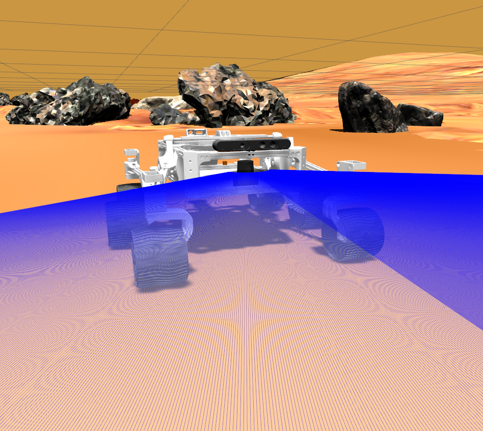
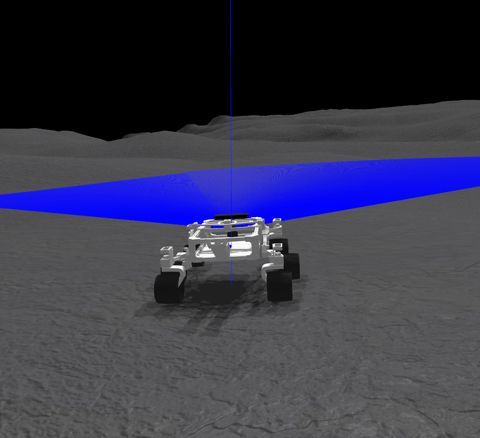

# ros2_rover

This is a ROS 2 (Foxy) version of the [Probable Adventure Project](https://github.com/gadiego92/probable-adventure). A [C++](./rover_motor_controller_cpp) version and a [Python](./rover_motor_controller) version of the lx16a controller are included. Besides, a [PS3 joy controller](./rover_bringup/launch/joy_teleop.launch.py) and a [hokuyo laser](./rover_bringup/launch/urg_node.launch.py) can be used.

<div align="center">
    
</div>

## Dependencies

```shell
rosdep install --from-paths src -r -y
```

## Usage

Clone the repository:

```shell
cd ~/ros2_ws/src
git clone https://github.com/mgonzs13/ros2_rover
```

Compile using colcon:

```shell
cd ~/ros2_ws
colcon build
source install/setup.bash
```

Launch the project:

```shell
source /opt/ros/foxy/setup.bash
ros2 launch rover_bringup rover.launch.py
```

## Rover Service

A Linux service can be created to control the execution and launch everything at boot time. To create the rover service, the following commands are used:

```shell
cd ~/ros2_ws/src/ros2_rover/rover_service
sudo ./install.sh
```

Check rover service:

```shell
sudo service rover status
```

## Gazebo

```shell
ros2 launch rover_gazebo mars.launch.py
```

<div>
    
    
</div>
