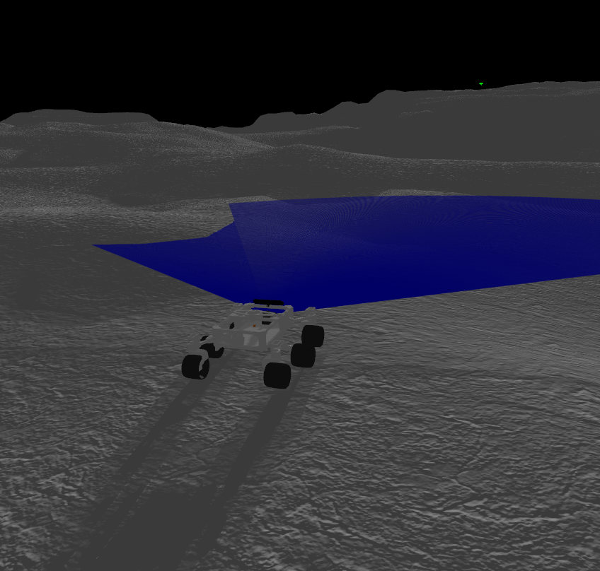
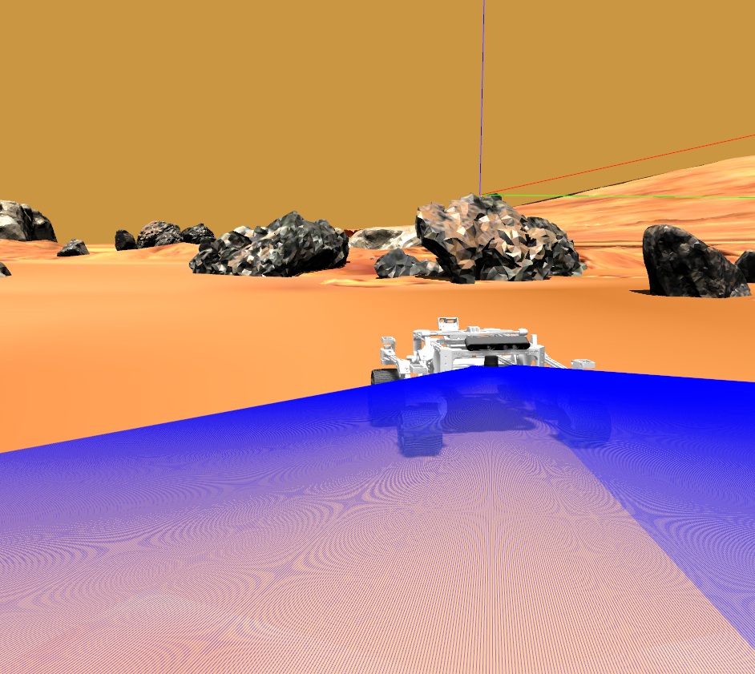
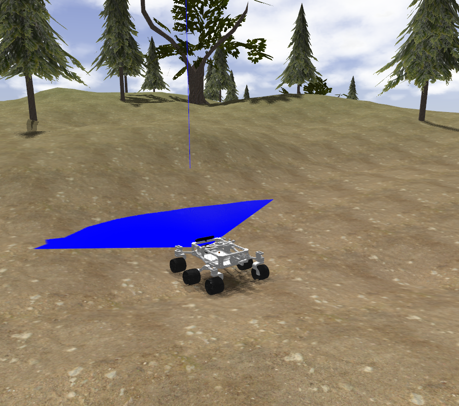

# ros2_rover

This is a ROS 2 (Humble) version of the [Sawppy the Rover](https://github.com/Roger-random/Sawppy_Rover). A [C++](./rover_motor_controller_cpp) version and a [Python](./rover_motor_controller) version of the lx16a controller are included. Besides, a [PS3 joy controller](./rover_bringup/launch/joy_teleop.launch.py) and a [hokuyo laser](./rover_bringup/launch/urg_node.launch.py) can be used.

## Table of Contents

1. [Installation](#installation)
2. [Usage](#usage)
   - [Linux Service](#linux-service)
3. [Gazebo Simulation](#gazebo-simulation)

## Installation

```shell
$ cd ~/ros2_ws/src
$ git clone https://github.com/mgonzs13/ros2_rover
$ cd ~/ros2_ws
$ rosdep install --from-paths src -r -y
$ colcon build
```

## Usage

<div align="center">
    
</div>

```shell
$ ros2 launch rover_bringup rover.launch.py
```

### Linux Service

A Linux service can be created to control the execution and launch everything at boot time. To create the rover service, the following commands are used:

```shell
$ cd ~/ros2_ws/src/ros2_rover/rover_service
$ sudo ./install.sh
```

Check rover service:

```shell
$ sudo service rover status
```

## Gazebo Simulation

### Moon

```shell
$ ros2 launch rover_gazebo moon.launch.py
```

<div>
    
</div>

### Mars

```shell
$ ros2 launch rover_gazebo mars.launch.py
```

<div>
    
</div>

### Forest

```shell
$ ros2 launch rover_gazebo forest.launch.py
```

<div>
    
</div>
