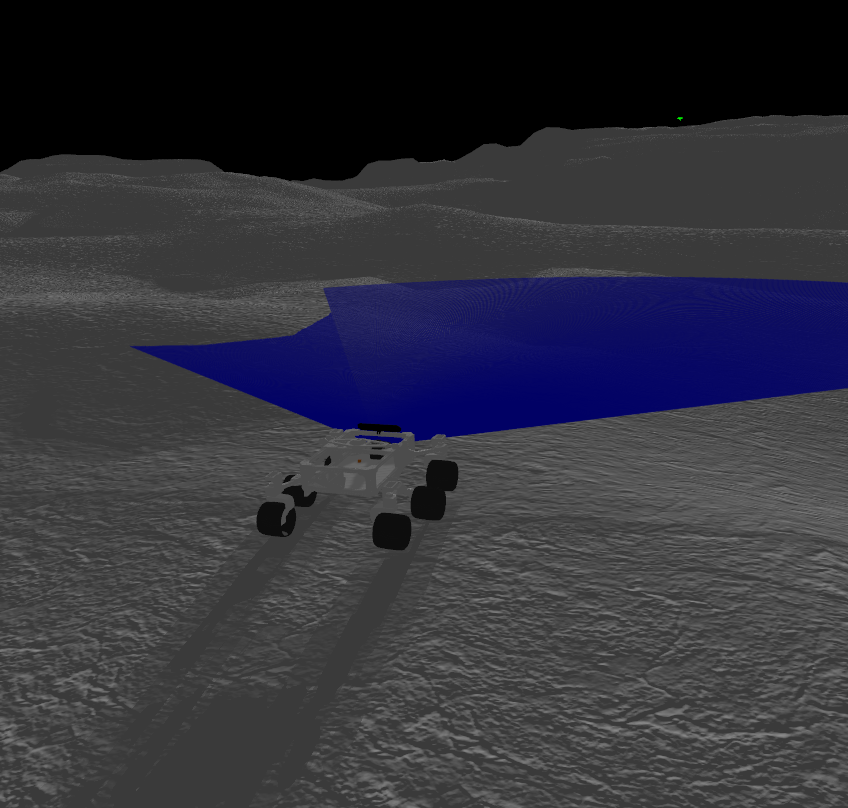
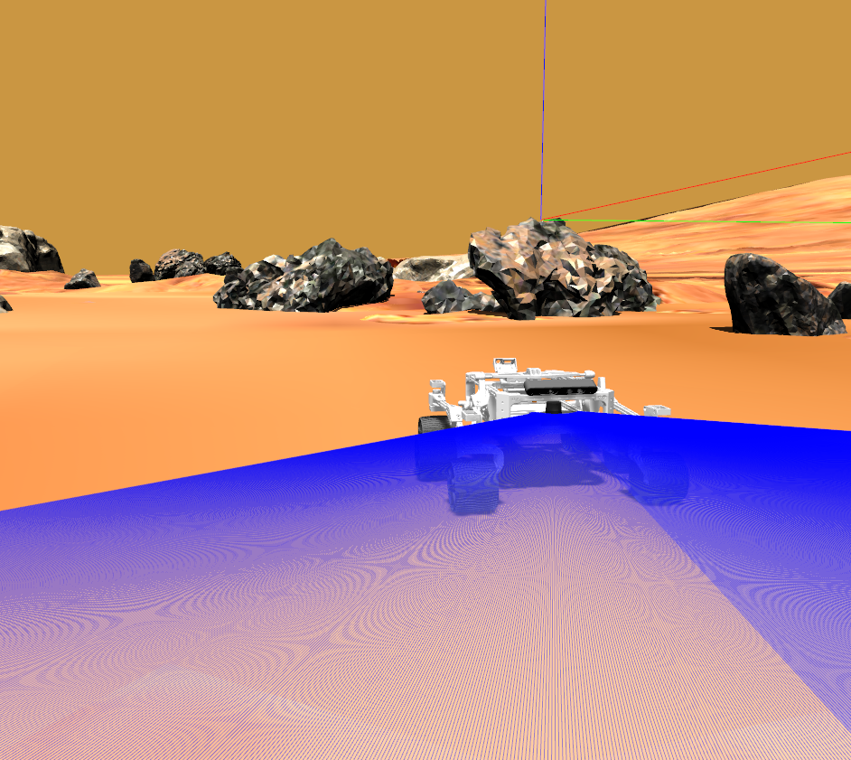
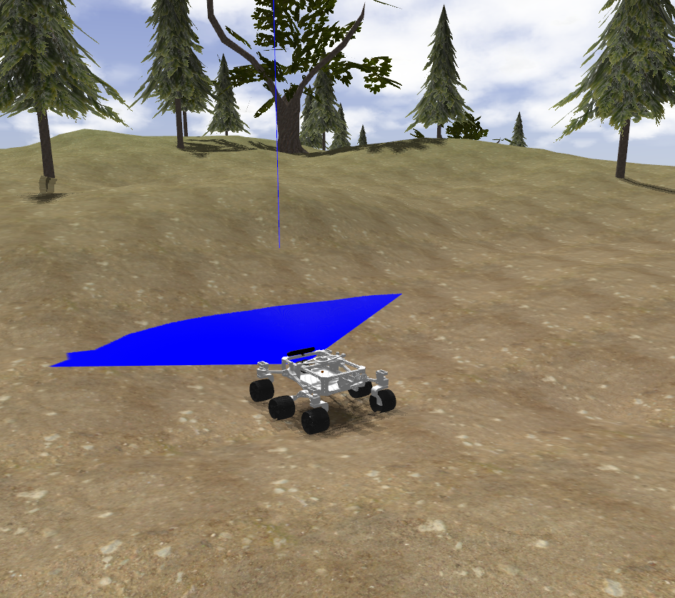

# ros2_rover

This is a ROS 2 (Humble) version of the [Sawppy the Rover](https://github.com/Roger-random/Sawppy_Rover). A [C++](./rover_motor_controller_cpp) version and a [Python](./rover_motor_controller) version of the lx16a controller are included. Besides, a [PS3 joy controller](./rover_bringup/launch/joy_teleop.launch.py) and a [hokuyo laser](./rover_bringup/launch/urg_node.launch.py) can be used.

<div align="center">

[](https://opensource.org/license/mit) [](https://github.com/mgonzs13/ros2_rover/releases) [](https://github.com/mgonzs13/ros2_rover?branch=humble) [](https://github.com/mgonzs13/ros2_rover/commits/maihumblen) [](https://github.com/mgonzs13/ros2_rover/issues) [](https://github.com/mgonzs13/ros2_rover/pulls) [](https://github.com/mgonzs13/ros2_rover/graphs/contributors) [](https://github.com/mgonzs13/ros2_rover/actions/workflows/python-formatter.yml?branch=humble) [](https://github.com/mgonzs13/ros2_rover/actions/workflows/cpp-formatter.yml?branch=humble)

| ROS 2 Distro |                             Branch                             |                                                                                                        Build status                                                                                                         |                                                             Docker Image                                                             | Documentation                                                                                                                                                    |
| :----------: | :------------------------------------------------------------: | :-------------------------------------------------------------------------------------------------------------------------------------------------------------------------------------------------------------------------: | :----------------------------------------------------------------------------------------------------------------------------------: | ---------------------------------------------------------------------------------------------------------------------------------------------------------------- |
|  **Humble**  | [`humble`](https://github.com/mgonzs13/ros2_rover/tree/humble) | [](https://github.com/mgonzs13/ros2_rover/actions/workflows/humble-docker-build.yml?branch=humble) | [](https://hub.docker.com/r/mgons/rover/tags?name=humble) | [](https://mgonzs13.github.io/ros2_rover/latest) |
|   **Iron**   | [`humble`](https://github.com/mgonzs13/ros2_rover/tree/humble) |    [](https://github.com/mgonzs13/ros2_rover/actions/workflows/iron-docker-build.yml?branch=humble)    |   [](https://hub.docker.com/r/mgons/rover/tags?name=iron)   | [](https://mgonzs13.github.io/ros2_rover/latest) |

</div>

## Table of Contents

1. [Installation](#installation)
   - [This fork (humble)](#this-fork-humble)
   - [Upstream](#upstream)
2. [Usage](#usage)
   - [Linux Service](#linux-service)
3. [Docker](#docker)
4. [Gazebo Simulation](#gazebo-simulation)
   - [Factory v2](#factory-v2)
5. [Citations](#citations)

## Installation

### This fork (humble)

The modified code lives on the `humble` branch. The fork's default branch is
`jazzy`, so a plain `git clone` checks out the wrong branch and none of the
changes below appear — pass `-b humble` explicitly:

```shell
cd ~/ros2_ws/src
git clone -b humble https://github.com/hyoiizza/ros2_rover
cd ~/ros2_ws
rosdep install --from-paths src -r -y
colcon build
```

If you already cloned without the branch, switch over in place:

```shell
cd ~/ros2_ws/src/ros2_rover
git fetch origin
git checkout humble
```

Confirm you are on the right branch before building:

```shell
git branch --show-current   # -> humble
```

### Upstream

```shell
cd ~/ros2_ws/src
git clone https://github.com/mgonzs13/ros2_rover
cd ~/ros2_ws
rosdep install --from-paths src -r -y
colcon build
```

## Docker

You can create a docker image to test this repo. Use the following common inside the directory of ros2_rover.

```shell
docker build -t rover .
```

After the image is created, run a docker container with the following command.

```shell
docker run -it --rm rover
```

## Usage

<div align="center">
    
</div>

```shell
ros2 launch rover_bringup rover.launch.py
```

### Linux Service

A Linux service can be created to control the execution and launch everything at boot time. To create the rover service, the following commands are used:

```shell
cd ~/ros2_ws/src/ros2_rover/rover_service
sudo ./install.sh
```

Check rover service:

```shell
sudo service rover status
```

## Gazebo Simulation

### Moon

```shell
ros2 launch rover_gazebo moon.launch.py
```

<div>
    
</div>

### Mars

```shell
ros2 launch rover_gazebo mars.launch.py
```

<div>
    
</div>

### Forest

```shell
ros2 launch rover_gazebo forest.launch.py
```

<div>
    
</div>

### Factory

```shell
ros2 launch rover_gazebo factory.launch.py
```

### Factory v2

A larger factory floor (25 m x 17 m) with racking, machine cells and conveyors.
Added on this fork.

```shell
ros2 launch rover_gazebo factory_v2.launch.py
```

Unlike the other worlds, this one fuses the 2D lidar into the occupancy grid on
top of the depth camera. That is controlled by the `subscribe_scan` argument,
which `factory_v2.launch.py` defaults to `True`:

```shell
# depth camera only, as the other worlds do
ros2 launch rover_gazebo factory_v2.launch.py subscribe_scan:=False
```

The argument sets RTAB-Map's `subscribe_scan` and switches `Grid/Sensor` between
`1` (depth camera) and `2` (lidar and depth camera).

Gazebo's sensor plugins need a render engine, so the simulation cannot run fully
headless — the depth camera and the lidar both publish nothing without a display.
Under WSLg, export the display before launching:

```shell
export DISPLAY=:0
```

#### Changes this fork makes for factory_v2

| File | Change |
| --- | --- |
| `rover_gazebo/worlds/factory_v2.world` | The world, converted from gz-sim to Gazebo Classic |
| `rover_gazebo/launch/factory_v2.launch.py` | Spawns the rover at the origin with `subscribe_scan:=True` |
| `rover_description/robots/rover.urdf.xacro` | RGB-D camera pitched up (`rpy="0 -0.2 0"`) to see shelving and walls |
| `rover_localization/launch/rtabmap.launch.py` | `subscribe_scan` exposed as an argument; the lidar was previously published but never consumed |
| `rover_localization/config/ekf_sim.yaml` | Simulation EKF config using `wheel_odom` |
| `rover_localization/launch/ekf.launch.py` | Picks `ekf_sim.yaml` when `use_sim_time` is true, `ekf.yaml` otherwise |

The simulated depth camera runs at only a few frames per second, so the visual
odometry the real rover fuses (`odom_rgbd`) loses tracking as soon as the rover
moves and stalls the filter. `ekf_sim.yaml` uses the wheel odometry instead.
Hardware behaviour is unchanged: `ekf.yaml` still fuses `odom_rgbd`.

## Citations

The `v0.7` version has been used in the work `Comparison of Concentric Surface Planetary Explorations Using an Ackerman Rover in a Lunar Simulation` from the `2024 International Conference on Space Robotics (iSpaRo)`.

```bibtex
@INPROCEEDINGS{10685849,
  author={González-Santamarta, Miguel Á. and Rodríguez-Lera, Francisco J.},
  booktitle={2024 International Conference on Space Robotics (iSpaRo)},
  title={Comparison of Concentric Surface Planetary Explorations Using an Ackerman Rover in a Lunar Simulation},
  year={2024},
  volume={},
  number={},
  pages={239-244},
  keywords={Spirals;Navigation;Moon;Cameras;Sensors;Visual odometry;Testing},
  doi={10.1109/iSpaRo60631.2024.10685849}
}
```
